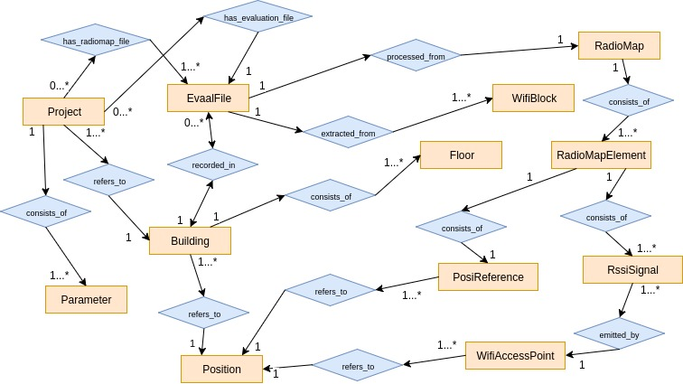

## Description of the REST API

### Overview

(Volkan)
General overview of available REST resources 

### Buildings

(Volkan)
REST Controller Building methods and calls

### Projects

(Volkan)
REST Controller Projects methods and calls

### Positioning

(Volkan)
REST Controller Positioning methods and calls

## Backend architecture

### Service architecture overview

(Volkan)
Overview of available services as class diagram

### Persistency Service

(Volkan)
Overview of persistency service with component as class diagram

### Positioning Service

(Volkan)
Overview of positioning service with component as class diagram

### Calculator Service

(Volkan)
Overview of calculator service with component as class diagram

### Example Workflow

(Nico)
An example workflow that demonstrates how services can be called
using the REST API, how they interact in the backend, and how they
yield results. 

## Persistence Layer

The following section provides a short overview of the __persistence layer__ of the backend. Because it uses __Spring Data JPA__ 
as an intermediate layer above the database, we do not execute any SQL statements ourselves; instead, operations on the 
database are carried out using __Spring's repository mechanism__.

We'll start off with an overview of the __database model__, introducing you to the entities present in the database and how they
are connected to each other. After that, you'll learn about the __database entities__ in detail; that is, why the entity was introduced, 
which functions it serves in the backend, and why its relations to other entities are the way they are.
 

### Database Model

An overview of the database model can be taken from the image below. Entity types are marked in orange; relation types are 
marked in blue.

### Database Entities

This section explains the details of the database entities. We'll begin with one of the central entities -- the *EvaalFile* entity.

##### EvaalFile
The *EvaalFile* entity is where it all begins -- it's what all other entities are built upon (and no, the name 'Evaal' is not 
a typo -- it was chosen to take account of the fact that this entire project is dedicated to [this competition](http://evaal.aaloa.org)). 
One *EvaalFile* entity represents one processed smartphone sensor log file as recorded by the [GetSensorData 2.0 app](https://lopsi.weebly.com/downloads.html). It doesn't represent 
the entire source file line-by-line because the backend currently -- as of January 2018 -- only supports the WIFI algorithm for 
position calculation which only requires POSI and WIFI lines, hence persisting the entire file, including other content lines as 
well, would be a waste of both processing time and memory.

Each *EvaalFile* entity is recorded in exactly one building (it says in the competition rules that one recording run does not span 
multiple buildings, but might include several floors), is connected to exactly one *RadioMap* entity, and has a list of 
*WifiBlock* entities attached to it. The *RadioMap* is processed from the source file using both its POSI lines and its 
WIFI lines, whereas the list of *WifiBlocks* is extracted using only the WIFI lines.  

#### RadioMap

## Functionality testing

(Nico)

### Blackbox tests overview

(Nico)
