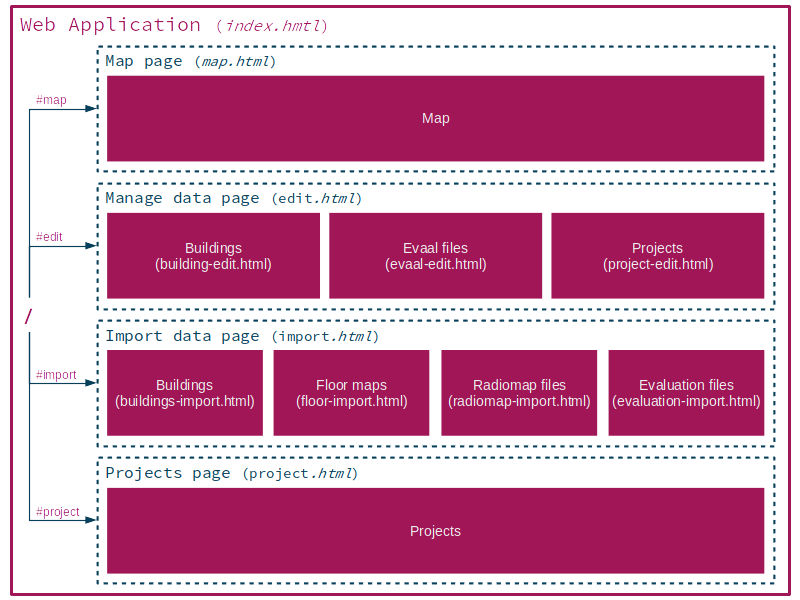
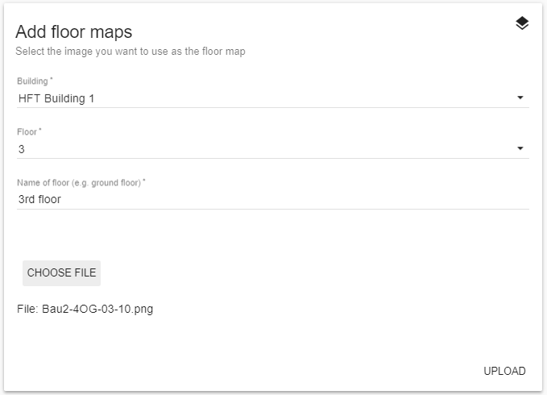
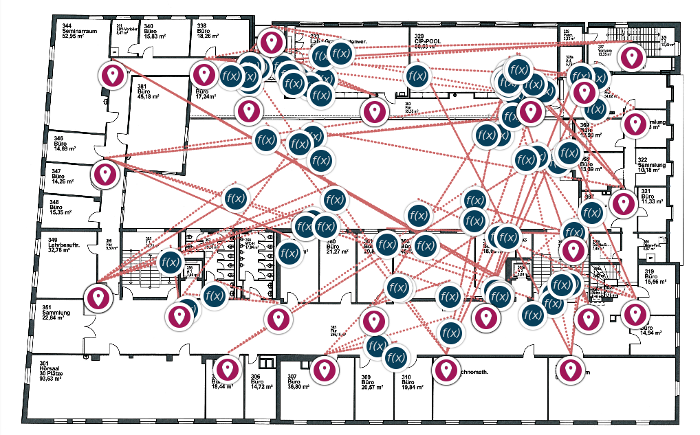
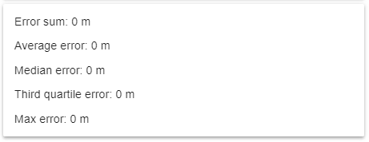
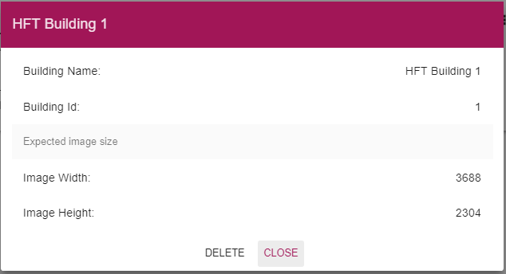
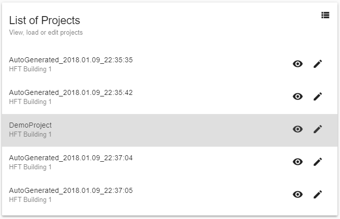
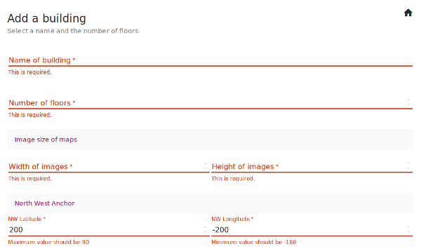

# FrontEnd Documentation

This file contains documentation regarding the structure and usage of the frontend.

# Table of Contents

  * [Libraries](#Libraries)
  * [File structure](#file-structure)
  * [Page overview](#page-overview)
  * [Site overview](#site-overview)
  * [Validation](#validation)

# Libraries

To make development easier several libraries were used for frontend development.
Here is a small overview:

- **AngularJS** - main UI framework
  - **angular-material** - material UI components
- **Openlayers** - html/js map library
  - **angular-openlayers-directive** - connect map with angular
- Others
  - **jquery** 
  - **Material Design Icons**
  
The main framework used is AngularJS which allows us to create a single page application easily.
We have used plugins like routes and messages to implement different functionality.
Angular-material is a framework for UI components. It provides reusable, tested and easily accessible UI components.
Openlayers was used to be able to display maps in our app. It uses *angular-openlayers-directive* to connect with angular.
The project also makes use of JQuery and Material design icons. The later provides different ready to use icons.

# File Structure

The frontend part of the application can be found in the folder `src/main/resources/static`.
It is structured like this:

```
static
├── index.html                      # main html page
├── app.js                          # main application definition
├── manifest.json                   # additional information for browsers
├── assets                          # assets like libraries and css
│   ├── css                             # own css files
│   ├── icons                           # own icons
│   └── vendor                          # external libraries (auto gen) 
├── pages                           # html/js files for pages
│   ├── map.html                        
│   ├── map.js
│   ├── ...
│   ├── forms                           # files describing parts of a page
│   │   ├── edit
│   │   │   ├── building-edit.html
│   │   │   ├── building-edit.js
│   │   │   └── ...
│   │   └── ...
│   └── panels                          # layouts for additional panels
└── components                          # services used by the pages
    ├── mapService.js
    ├── calculationService.js
    └── ...

```

- On the root the index.html can be found which is the entry point of our single page application,
it describes the outer layout and imports all needed libraries.
In addition you also find the app.js file which is the entry point of our angular application.
- The pages folders holds the dedicated pages (consisting of html and js with page logic) which are
injected by angular into the main html file to display the contents (e.g. map.html/js for the map view).
The subfolder forms holds single components describing dedicated parts of a page like the
edit-building.html/js for the building part of the edit page
- The components folder is for additional angular components not bound to a specific page,
it contains services e.g. the calculationService.js which provides access to the calculation API of the backend
to all pages which need it.

# Page Overview

As already stated the web application was designed as a single page application.
This does not mean though that there is only one page to work with, its only a single page as which is modified dynamically
using javascript. 
This means we also have a certain page hierarchy which you can see here:



The root (**/**) of the page is provided by the index.html, it does not contain any content (except Toolbar and Navigation) but redirects to the map page automatically.
From there you can access the map, manage, edit and project pages through the main menu. These pages then can have several sub pages (usually displayed as a tab bar) like the import building page.

Although it is delivered as a single html page to the browser, the sites are defined in single *.html* files (structure see above) with their own *.js* file if logic is needed.
A dedicated page like the map view may also be split up into multiple parts (.html files) although they are displayed at once (e.g. the map configuration side bar).
This makes it easier to keep an overview during development.

A description of the single pages is available at the [site overview](#site-overview).

# Site Overview

In this section, different components and pages of the front end will be discussed as the front end plays an important role in our project. The components will be discussed according to the workflow i.e in the order how we will use the pages to get the final results.

## Toolbar


The toolbar is the main navigation element of the site. It is available at all pages which makes the navigation easy. Since the project makes use of the single page application, the toolbar is not required to be added in each html page and implemented only at one place.

The toolbar has two options represented with following icons.


 The first icon is . Once this menu button is clicked, the following side bar will appear.

 

 It has the following options

 - Map View
 - View Projects
 - Import Data
 - Manage Data

 The following sections will explain each of these menu options and submenus under them with respect to the workflow.

## Import Data

This section is dedicated for the import options. The data needs to be fed to the system to obtain the results. Once you click on the Import Data option from the navigation side bar, a secondary toolbar will appear below the main toolbar providing different import options. The second toolbar is shown below.


### Buildings

In this page, you can add building related data such as name, number of floors and dimensions of the floor map image.


It also has an option to add the coordinates either with *center and rotation* or add with *Latitudes and Longitudes*. Below images show these options.


To add the coordinates with *Center and Rotation* the radio button has to be turned on.


Even though these parts are explained separately, they are present in the single page.

Once the building is added successfully, a toast will appear like below.


### Floor Maps

This page is dedicated to upload the floor image along with the building and floor selection which was added previously.



If the file is uploaded successfully, a toast will be displayed indicating the success or a error toast will guide the user.

### Radiomap Data

This page will allow the user to upload Radiomap file. The dropdown will provide the list of the building names which were added before. The user can also add transformed log file by switching on the *Add a transformed points file*. This file will be automatically converted to get the positions.


### Evaluation Data

The upload page for Evaluation file works similar to Radiomap upload. It also has a list of buildings for which the user wants to upload the evaluation file. Once the file is uploaded successfully, a toast will be displayed.


## Map View

Once all the data is uploaded successfully in the Import Data section, the results can be fetched in Map View. At the right hand side,  button will toggle a side panel. The panel has different parameters to choose from.

The first block provides the list of buildings and the floors available for that building. Once the user clicks on *CHOOSE* button, next block will appear. The floor map image will change according to the building and floor selected.


Next block allows the user to choose from a prerecorded track for the evaluation.


After the evaluation file has been chosen, the user has to choose from different algorithms.


The panel provides many more parameters to play with. These can be accessed under *SHOW MORE PARAMETERS*. Also these settings can be saved as a project so that the user can reuse the same set of parameters.


After all the parameters are set, the user needs to click on *CALCULATE*. This will populate the results on the map showing the reference points, calculated positions and error lines.



At the end of the panel, there is also indication of error in calculation of positions with this set of parameters and algorithm.



## Manage Data

Since the project needs comparatively high amount of parameters to be fed to the backend, it can be time consuming every time to repeat the same process. Therefore, we have provided a feature where the user can access the data which he/she has uploaded already. This is achieved in the *Manage Data* section.

Once the Manage Data menu option is clicked, a secondary toolbar will appear below the main toolbar.


### Buildings

This page lists all the projects saved by the user.


The user can click on any building to view the details. Also, the building can be deleted. But if the building is associated with any radio map, evaluation files or any other project, the user cannot delete the building.



### Evaluation Files

This page lists all the evaluation and radio map files uploaded. The user can also delete any of these files similar to deleting a building.


### Projects

The list of all the saved projects can be accessed from here.



## View Projects

This section is same as the list of projects which is available in the *Manage Data* menu. It is made available separately for easy access.

# Validation

In this project, the frontend validation is handled through a module called *ngMessages* provided by AngularJS. It provides an elegant way to validate mandatory fields, emails, min/max for a field and customized validation using regular expressions. In this project, we are using it to check for required fields, range of Latitudes and Longitudes.


