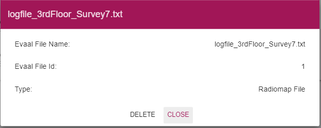
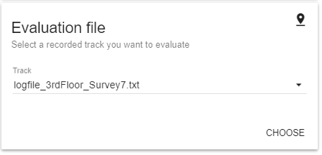
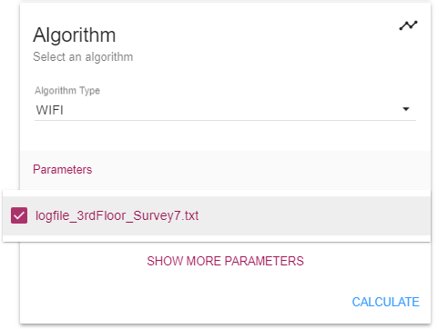

# User Guide

In this section, different components and pages of the front end will be discussed as the front end plays an important role in our project. The components are grouped according to the tasks with respect to different elements of the project.

## Navigation

The toolbar is the main navigation element of the site. It is available at all pages which makes the navigation easy. Since the project makes use of the single page application, the toolbar is not required to be added in each html page and implemented only at one place.

The toolbar has two options represented with following icons.

 The first icon is . Once this menu button is clicked, the following side bar will appear.

 

 It has the following options

 - Map View
 - View Projects
 - Import Data
 - Manage Data

 The secondary toolbar is also available below the main toolbar for some of the menu options.It differs according to the menu item selected.

 Once you click on the Import Data option from the navigation side bar, a secondary toolbar will appear below the main toolbar providing different import options. The second toolbar is shown below.

 

 The secondary toolbar changes like below once the Manage Data menu option is clicked,below the main tool bar.

 

## Buildings

This section explains about all the tasks the user can do regarding the buildings. It explains how to add the building data, fetch the list of buildings and delete the building data.

### Add Building

In this page, you can add building related data such as name, number of floors and dimensions of the floor map image. This page can be accessed under *Import Data / Buildings*.

It also has an option to add the coordinates either with *center and rotation* or add with *Latitudes and Longitudes*. Below images show these options.

To add the coordinates with *Center and Rotation* the radio button has to be turned on.

Even though these parts are explained separately, they are present in the single page.

Once the building is added successfully, a toast will appear like below.

This page allows the user to upload the image of the floor along with the building and floor selection which was added previously.

If the file is uploaded successfully, a toast will be displayed indicating the success or a error toast will guide the user.

### List of Buildings

This page lists all the buildings uploaded by the user. This can be accesed at path *Manage Data / Buildings*.

### View / Delete Building

The user can click on any building to view the details. Also, the building can be deleted with the *Delete* button provided. But if the building is associated with any radio map, evaluation files or any other project, the user cannot delete the building.

## Radiomap Data & Evaluation Data

This section explains tasks related to Radio maps.

### Add Radio Map Data

The page in the below image will allow the user to upload Radiomap file. The dropdown will provide the list of the building names which were added before. The user can also add transformed log file by switching on the *Add a transformed points file*. This file will be automatically converted to get the positions. This page can be accessed under *Import Data / Radiomap Data*.

### Add Evaluation Data

The upload page for Evaluation file works similar to Radiomap upload. It also has a list of buildings for which the user wants to upload the evaluation file. Once the file is uploaded successfully, a toast will be displayed. This page can be accessed under *Import Data / Evaluation Data*.

## List of Files

This page lists all the evaluation and radio map files uploaded. The user can also delete any of these files similar to deleting a project. This can be accesed at path *Manage Data / Evaluation Files*.

## View / Delete Log File

The user can view or delete the radio map file or evaluation file similar to buildings. By clicking on any listed file, a popup with details appear with delete option.

## Map View

Once all the data is uploaded successfully in the Import Data section, the results can be fetched in Map View. At the right hand side,  button will toggle a side panel. The panel has different parameters to choose from.

The first block provides the list of buildings and the floors available for that building. Once the user clicks on *CHOOSE* button, next block will appear. The floor map image will change according to the building and floor selected.

Next block allows the user to choose from a prerecorded track for the evaluation.

After the evaluation file has been chosen, the user has to choose from different algorithms.

The panel provides many more parameters to play with. These can be accessed under *SHOW MORE PARAMETERS*. Also these settings can be saved as a project so that the user can reuse the same set of parameters.

After all the parameters are set, the user needs to click on *CALCULATE*. This will populate the results on the map showing the reference points, calculated positions and error lines.

At the end of the panel, there is also indication of error in calculation of positions with this set of parameters and algorithm.

# Validation

In this project, the frontend validation is handled through a module called *ngMessages* provided by AngularJS. It provides an elegent way to validate mandatory fields, emails, min/max for a field and customised validation using regular expressions. In this project, we are using it to check for required fields, range of Latitudes and Longitudes.

