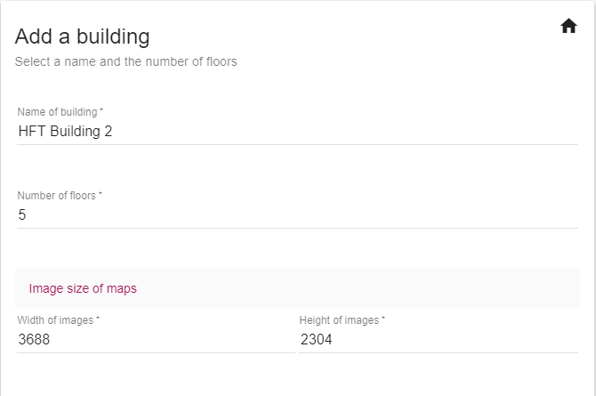
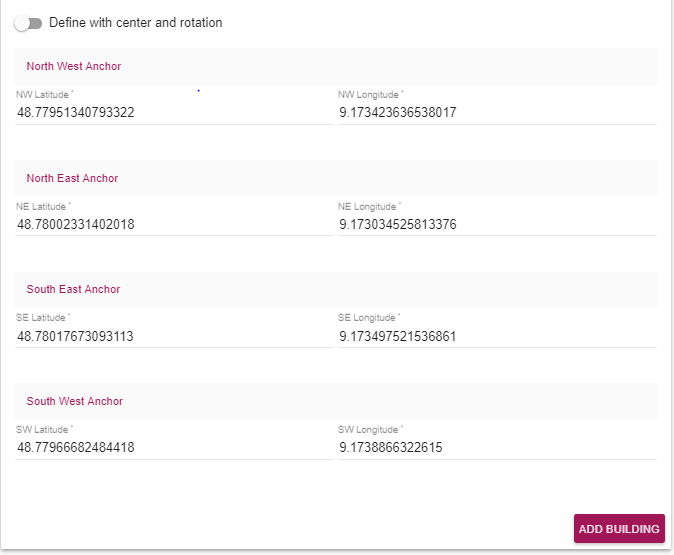
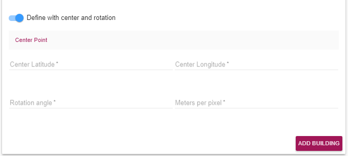
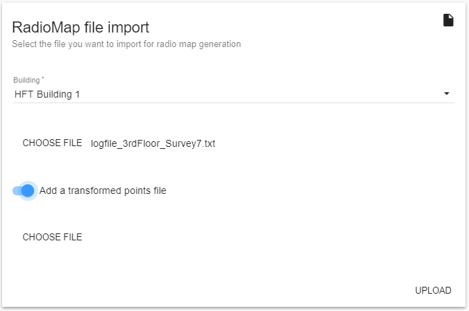
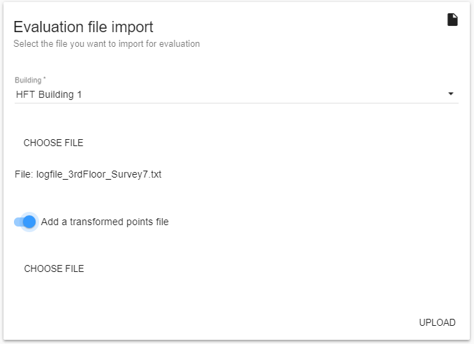
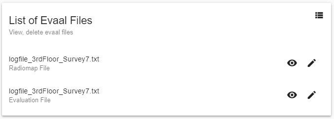
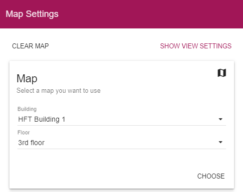
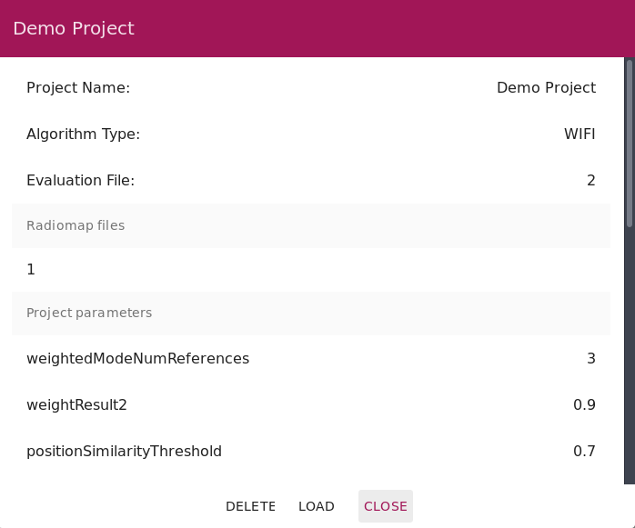

# Frontend User Guide

In this document, different components and pages of the frontend will be discussed, it explains the basic navigation as well as usage of the frontend.
The components are grouped according to their tasks with respect to different elements of the project.

# Table of Contents

* [Navigation](#navigation)
* [Buildings](#buildings)
  * [Add a Building](#add-building)
  * [Add a floor map](#add-a-floor-map-to-a-building)
  * [View / delete a building](#manage-buildings)
* [Radiomap Data and Evaluation Data](#radiomap-data-and-evaluation-data)
  * [Add radiomap data](#add-radio-map-data)
  * [Add evaluation data](#add-evaluation-data)
  * [View / delete a log file](#manage-log-files)
* [Map View](#map-view)
  * [Run a calculation](#run-a-calculation)
* [Projects](#projects)
  * [Save a project](#save-a-project)
  * [View projects](#view-projects)
  * [Load or delete a project](#load-or-delete-a-project)
* [Validation](#validation)

# Navigation

The toolbar is the main navigation element of the site. It is available on all pages which makes the navigation easy. Since the project makes use of the single page application, the toolbar is not required to be added to each HTML page and implemented only at one place.

The toolbar has two options represented by following icons.

 The first icon is . Once this menu button is clicked, the following sidebar will appear.

 

 It has the following options

 - Map View
 - View Projects
 - Import Data
 - Manage Data

 The secondary toolbar is also available below the main toolbar for some of the menu options. It differs according to the menu item selected.

 Once the user clicks on the Import Data option from the navigation sidebar, a secondary toolbar will appear below the main toolbar providing different import options. The second toolbar is shown below.

 

 The secondary toolbar changes like below once the Manage Data menu option is clicked below the main toolbar.

 

# Buildings

This section explains about all the tasks the user can do regarding the buildings. It explains how to add the building data, fetch the list of buildings and delete the building data.

## Add Building

In this page, you can add building-related data such as name, number of floors and dimensions of the floor map image. This page can be accessed under *Import Data / Buildings*.

It also has an option to add the coordinates either with the *center and rotation* or with *Latitudes and Longitudes*. Below images show these options.

To add the coordinates with *Center and Rotation* the radio button has to be turned on.

Even though these parts are explained separately, they are present in the single page.

Once the building is added successfully, a toast will appear with a success message.

## Add a floor map to a building

This page allows the user to upload the image of the floor along with the building and floor selection which was added previously.
This page is available at *Import Data / Floor Maps*

If the file is uploaded successfully, a toast will be displayed indicating the success or an error toast will guide the user.

## Manage Buildings

This page lists all the buildings uploaded by the user. This can be accessed at *Manage Data / Buildings*.

### View / Delete Building

The user can click on any building to view the details.
The building can also be deleted with the *Delete* button provided.
But if the building is associated with any radio map, evaluation files or any other project,
the user cannot delete the building.

# Radiomap Data and Evaluation Data

This section explains tasks related to Radio maps.

## Add Radio Map Data

The page in the below image will allow the user to upload Radiomap file.
The dropdown will provide the list of the building names which were added before.
The user can also add transformed log file by switching on the *Add a transformed points file*.
This file will be automatically converted to get the positions.
This page can be accessed under *Import Data / Radiomap Data*.

## Add Evaluation Data

The upload page for Evaluation file works similar to Radiomap upload.
It also has a list of buildings for which the user wants to upload the evaluation file.
Once the file is uploaded successfully, a toast will be displayed.
This page can be accessed under *Import Data / Evaluation Data*.

## Manage Log Files

This page lists all the evaluation and radio map files uploaded.
This can be accessed at path *Manage Data / Evaluation Files*.

### View / Delete Log File

The user can view or delete the radio map file or evaluation file similar to buildings. By clicking on any listed file, a popup with details appears with the delete option.

# Map View

## Run a calculation

Once all necessary data is uploaded successfully using the *Import Data* section, the algorithm runs can be started and results can be fetched in Map View.
At the right-hand side of this page, the  button will toggle a side bar.
This side bar provides a few blocks to setup an algorithm run and executed it.
They appear one after each other when necessary.

The first block provides a list of buildings and the corresponding floors available for that building.
Once the user clicks on *CHOOSE* button they will be set and the next block will appear.
The image floor map will also change according to the selection, the map will be empty if no image was uploaded yet.

This next block allows the user to choose an uploaded prerecorded track for the evaluation of the algorithm.

After the evaluation file has been chosen, the user gets to choose from different algorithms (only one for now).
When an algorithm is selected the available parameters are retrieved from the backend and are presented to the user (with defaults already set).

The most important part is the selection of the uploaded radiomaps you want to use.
The panel provides many more additional parameters to play with.
These can be accessed by clicking *SHOW MORE PARAMETERS*.

After all the parameters are set, the user needs to click on *CALCULATE*.
This will execute the algorithm with the chosen settings and populate the results on the map showing the reference points,
calculated positions, and error lines between them (they can be toggled using the **SHOW VIEW SETTINGS** button at the top).

At the end of the side bar, after running the algorithm, there is also an indication of the error in the calculation of positions with this set of parameters and algorithm.

# Projects

## Save a project

The settings used for a calculation can also be saved as a project so that the user can reuse the same set of parameters later again.
After executing a calculation like described above, you just have to enter a name below the results and click on **SAVE PROJECT**.

## View Projects

To access the list of available projects you can either use the navigation entry **View Projects** or use the *Projects* tab of the **Manage Data** page.
The list looks like these showing all projects and the building they are assigned to.

## Load or delete a project

When clicking on an entry in this list you get some details about the project like the algorithm and parameters used.
Below are two buttons to **DELETE** the project or to **LOAD** the settings into the map view.

# Validation

In this project, the frontend validation is handled through a module called *ngMessages* provided by AngularJS.
It provides an elegant way to validate mandatory fields, emails, min/max for a field and customized validation using regular expressions.
In this project, we are using it to check for required fields, the range of Latitudes and Longitudes.

To display messages of success and error to the user we use toasts which look like this:

